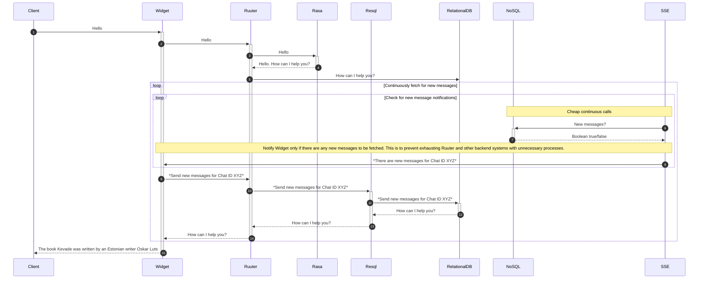
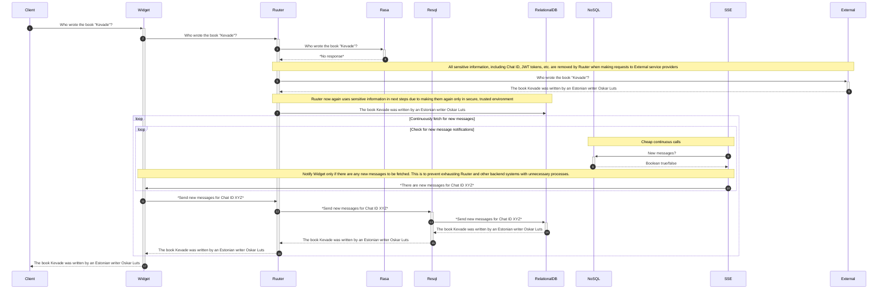

### Data journey

#### Legend

`Client` is the end client talking to Bürokratt.

`Widget` is a chat widget developed by Bürokratt, but installed by institutions themselves.

`Ruuter` is one of Bükstack's core components used by Bürokratt.

`Resql` is one of Bükstack's core components used by Bürokratt.

`SSE` is one of Bükstack's core components used by Bürokratt.

`Rasa` is an external software to provide basic chat services and create rules for more complicated chat flows.

`RelationalDB` is a Postgres database by default, but could be potentially switched to any other relational databases.

`NoSQL` is OpenSearch by default, but could be potentially switched to other NoSQL databases.

`External` is considered as a service provided by any third-party service providers. They can be LLMs, classifiers, etc.

#### Use case nr 1 - End Client gets their response from Rasa

This is an overview of data journey when the End Client chats with Bürokratt and gets their response from local Rasa.

External service providers are missing from this sequence diagram as they do not have any role in such use cases.

#### Use case nr 2 - End Client gets their response from and External source

This is an overview of data journey when the End Client chats with Bürokratt and gets their response from an External service providers due to local Rasa not being able to respond.

