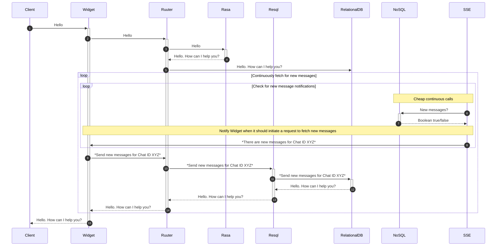

### Use case nr 1 - End Client gets their response from Rasa

```mermaid
sequenceDiagram
  participant Client
  participant Widget
  participant Ruuter
  participant Rasa
  participant Resql
  participant RelationalDB
  participant NoSQL
  participant SSE

  autonumber
  Client->>+Widget: Hello
  Widget->>+Ruuter: Hello
  Ruuter->>+Rasa: Hello
  Rasa-->>-Ruuter: Hello. How can I help you?
  Ruuter->>RelationalDB: Hello. How can I help you?

  loop Continuously fetch for new messages
    loop Check for new message notifications
      note over SSE,NoSQL: Cheap continuous calls
      SSE->>+NoSQL: New messages?
      NoSQL-->>-SSE: Boolean true/false
      note over Widget,SSE: Notify Widget when it should initiate a request to fetch new messages
      SSE->>Widget: *There are new messages for Chat ID XYZ*
    end

    Widget->>Ruuter: *Send new messages for Chat ID XYZ*
    Ruuter->>+Resql: *Send new messages for Chat ID XYZ*
    Resql->>+RelationalDB: *Send new messages for Chat ID XYZ*
    RelationalDB-->>-Resql: Hello. How can I help you?
    Resql-->>-Ruuter: Hello. How can I help you?
    Ruuter-->>-Widget: Hello. How can I help you?
  end
  
  Widget-->>-Client: Hello. How can I help you?
```
