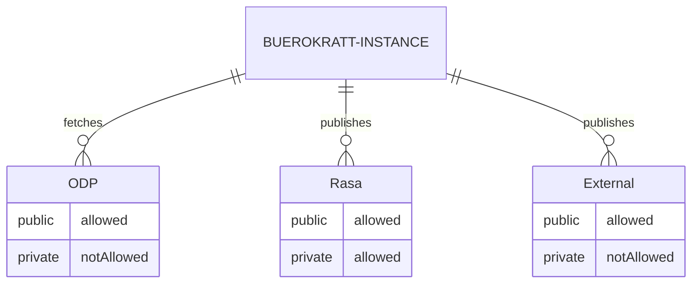

### Data population

By `Bürokratt's instances` we consider every institution using Bürokratt, e.g. the Information System Authority of Estonia

`Admin` is every Bürokratt's instance's own administrator having acces to their Bürokratt's instances based on defined rules

`Rasa` is every Bürokratt's instance's own local Rasa, which only they can access

`External` is an external service provider hosting data, LLMs, etc. outside of Bürokratt's instances control

